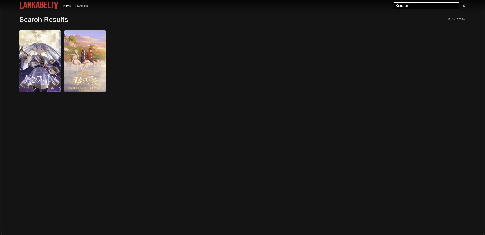
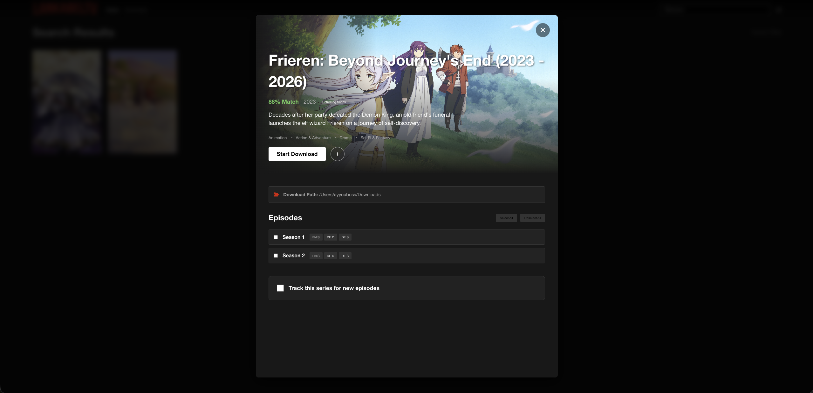

# LankabelTV 📺

<div align="center">
  <a href="https://www.buymeacoffee.com/ayyouboss" target="_blank">
    
  </a>
</div>

<div align="center">
  
  <br>
  
  <br>
  
</div>

---

LankabelTV ist ein modernes, schnelles und ressourcenschonendes Command-Line-Tool sowie Web-Interface zum Herunterladen und Streamen von Anime und Serien. 

Im Gegensatz zu anderen Tools setzt LankabelTV nicht auf schwerfällige Browser-Automatisierung, sondern nutzt direkte HTTP-Requests und leistungsstarke Bibliotheken wie `yt-dlp` und `BeautifulSoup`. Dies sorgt für maximale Performance und eine einfache Einrichtung.

## ✨ Features

- **Modernes Web-UI:** Eine elegante, "Netflix-ähnliche" Weboberfläche mit dynamischen Katalogen.
- **TMDB-Integration:** Automatische Anreicherung von Serien und Animes mit Postern, Beschreibungen und Bewertungen direkt aus The Movie Database.
- **Ressourcenschonend:** Keine virtuellen Displays (Xvfb) oder Chromium-Instanzen nötig. Läuft nativ und leichtgewichtig.
- **Multi-Source Support:** Unterstützt nahtlos Inhalte von verschiedenen Providern.
- **Interaktives CLI:** Eine schnelle Curses-basierte Kommandozeilenoberfläche für Terminal-Liebhaber.
- **Smart Search:** Integrierter Inhaltsfilter und optimierte Suchlogik.

## 🚀 Quick Start

### Voraussetzungen
- Python 3.9 oder höher
- `ffmpeg` (für die Videoverarbeitung)

### Installation

```bash
# Repository klonen
git clone https://github.com/Ayyouboss0011/LankabelTV.git
cd LankabelTV

# Abhängigkeiten installieren
pip install -r requirements.txt
pip install -e .
```

### Starten

```bash
# Web-UI starten (Standard)
lankabeltv -w -p 8080

# CLI Modus starten
lankabeltv
```

## 🐳 Docker Deployment

LankabelTV ist vollständig für Docker optimiert. Da keine Browser-Abhängigkeiten bestehen, ist das Image extrem klein und effizient.

```bash
docker-compose up -d --build
```
*Deine Downloads landen standardmäßig im gemounteten `./downloads` Verzeichnis.*

## 🛠️ Technologien

LankabelTV basiert auf einem robusten Python-Stack:
- **Scraping & Downloads:** `requests`, `BeautifulSoup4`, `yt-dlp`
- **Web-Frontend:** `Flask`, Modernes Vanilla JS, CSS Variables
- **CLI:** `npyscreen`, `curses`

## ⚠️ Legal Disclaimer

LankabelTV ist ein reines Client-Side-Tool. Es hostet, speichert oder verteilt selbst keine urheberrechtlich geschützten Medien. Die Nutzung dieses Tools geschieht auf eigene Verantwortung. Stelle sicher, dass du die Nutzungsbedingungen der Webseiten, auf die du zugreifst, sowie die in deinem Land geltenden Gesetze respektierst.

## 📄 Lizenz

Dieses Projekt ist unter der MIT Lizenz veröffentlicht. Siehe die `LICENSE` Datei für weitere Details.
